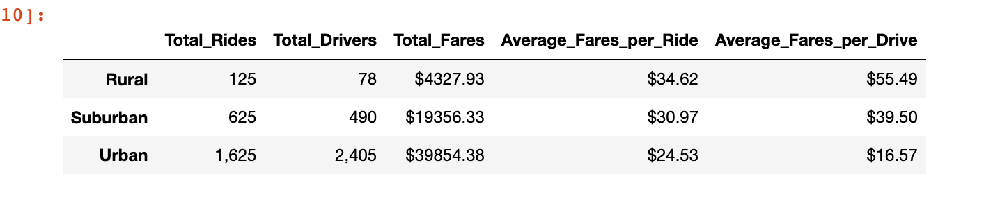
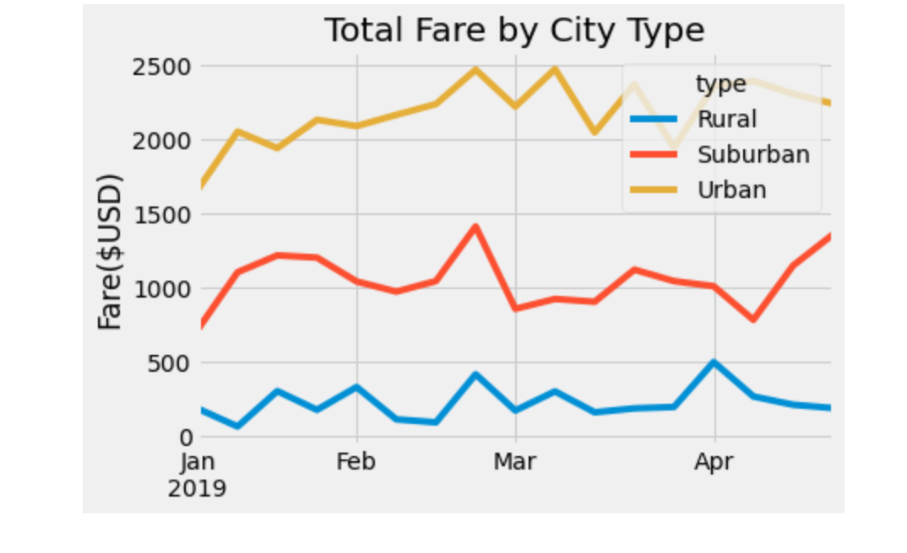

# PyBer_Analysis

## Overview of Project
The purpose of this analysis is to create a variety of charts that showcase the
relationship between the type of city, and the number of drivers and riders,
as well as the percentage of total fares, riders and drivers by type of city.
The analysis and visualizations will help PyBer improve access to ride-sharing
services and determine affordability for underserved neighborhoods. Moreover,
by using the matplotlib library of python to do bar, pie, and scatter plots of
data, we can get more familiar with doing data visualizations.

## Results

According to the picture I get above, rural area has the lowest total_rides,
total_drivers, and total_fares, which lead to the higher average fares per ride
and per drive. And the urban area has the highest total_rides, total_drivers,
and total_fares which lead to lower average fares per ride and per drive. Therefore,
I can conclude that with higher total_rides and total_drivers, it is more likely
to have lower average fares per ride and per drive.

Above all, the urban area tends to have highest fare at all time but showing
a decreasing trend. the suburban area is showing an increasing trend.

## Summary

- Higher total_rides and total_drivers leads to higher fares and lower average fares per ride and per drive.
  - in order to increase affordability in rural area, we need to add more drivers.
- Suburban area is showing an increasing trend of fares and urban is showing an decreasing trend.
  - the urban area has highest fare at all time, but may start to reach equailibrium.
- decrease drivers in urban and increasing drivers in rural and suburban.
